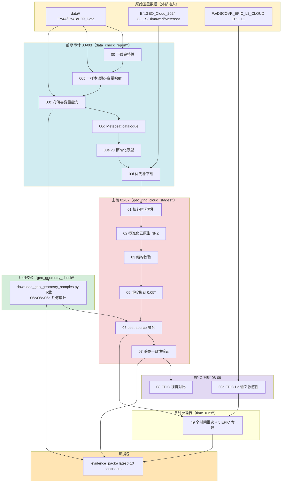

# GEO-ring Cloud 任务 — 索引图

> 配套数据存储：`geo_ring_cloud_index.sqlite` / `geo_ring_cloud_index.xlsx`
> 生成时间：2026-07-07 ｜ 项目根：`D:\AAAresearch_paper`
> 相关性图例：★强相关 ｜ ◆上游相关 ｜ ○弱相关 ｜ ✗无关

---

## 一、顶层目录树（带相关性标注）

```
D:\AAAresearch_paper\
│
├── ★ geo_ring_cloud_stage1\                         ← Stage1 主产物根（STAGE_ROOT，816 文件 / ~6.4GB）
│   ├── config\          core_product_definition.yaml
│   ├── scripts\         16 个脚本副本（运行时自动复制留痕，非主代码源）
│   ├── time_index\      core_time_index.csv / usable_times_ranked.csv        【阶段01】
│   ├── standardized_native\  6 卫星标准化云 NPZ + 校验/语义 CSV               【阶段02/03/03.5】
│   ├── quicklooks_native\    原生网格 quicklook PNG
│   ├── reprojected_grid\     0.05° 重投影 NPZ（6 卫星子目录）+ target_grid_definition.json 【阶段05】
│   ├── quicklooks_reprojected\
│   ├── fused_best_source\    fused_geo_ring_cloud_*.npz + source/rating/valid_count map + 统计CSV 【阶段06】
│   ├── source_selection_diagnostics\  【阶段06.5】
│   ├── geometry_audit_06c\   【阶段06c】
│   ├── geometry_angle_sync_06e\  角度层 NPZ（6×7）+ policy.yaml              【阶段06e】
│   ├── data_asset_audit_06f\  audit_summary.json + data_asset_audit.sqlite   【阶段06f】
│   ├── overlap_validation\    【阶段07 历史版】
│   ├── overlap_validation_07p\【阶段07p 修复版】
│   ├── epic_visual_comparison\【阶段08 原型时次】
│   ├── FY4B_DATA_INTRO\       FY4B 产品说明 PDF（13 个）
│   └── reports\               全阶段 markdown 报告（21+）+ 附件 CSV/YAML
│
├── ★ geo_ring_cloud_stage1_time_runs\               ← 多时次运行（23391 文件）
│   ├── 20240305_1500 … 20240331_1900  （49 个时间批次，2024-03 全月）
│   │     └── 每批：single_sample_run_manifest.json / pipeline_run_status.csv
│   │            / standardized_native / reprojected_grid / fused_best_source
│   │            / epic_l2_cloud_mask_semantic_sensitivity_* / reports / scripts / logs
│   └── epic_202403_*  （5 个 EPIC 专题：batch_runs / meteosat_time_offset_control
│                       / multisample_summary(含组会PPT) / overnight_watch / target_selection）
│
├── ★ geo_ring_cloud_stage1_evidence_pack\           ← 证据包（latest + 10 snapshots）
│   ├── latest\  README / stage_registry / evidence_manifest.json
│   │           / cross_cutting\(12 索引) / pipeline_stages\(00-07 阶段页) / config\
│   └── snapshots\  20260623T152635Z … 20260624T092254Z（10 个不可变快照）
│
├── ★ third_report\code\geo_ring_cloud_stage1\       ← ★★ Stage1 主代码（41 个 .py，01-09 全流水线）
│   ├── stage1_common.py        核心共享库（路径常量/码表/读取器）
│   ├── 01_… 02_… 03_… 03_5_… 04_… 04b_… 05_… 06_… 06_5_…        【主链 01-06.5】
│   ├── 06c_…(×2) 06d_… 06e_…(×2) 06f_…(×3)                      【几何/资产审计 06c-06f】
│   ├── 07_… 07p_… 07p_b_… 07v2_…                                【重叠验证 07】
│   ├── 08_… 08b_… 08c_… 08d_… 08e_… 08f_… 08g_… 08h_… 08i_… 08j_… 08k_…  【EPIC 对照 08】
│   ├── 09_stage09_… / stage09b_full_overnight\ / stage09c_scaled_batch\   【Stage09 扩展】
│   ├── download_geo_geometry_samples.py   → 产出 geo_geometry_check\
│   ├── rebuild_stage1_evidence_pack.py    → 产出 evidence_pack\
│   └── run_epic_georing_single_sample.py / run_epic_georing_sample_batch.py  【运行器】
│
├── ★ data_check_report\                             ← 前序审计（REPORT_ROOT，185 文件 / ~872MB）【阶段00-00f】
│   ├── parsed_file_metadata.csv / manual_variable_mapping_by_product.yaml   ← stage1_common 直接读取
│   ├── geometry_variable_audit\  product_variable_inventory_full.csv 等 16 文件
│   ├── standardized_cloud_v0_samples\ / priority_download_run_goes_meteosat\
│   ├── meteosat_catalogue_discovery\ / meteosat_product_series_audit\
│   └── fy4b_*/goes_*/himawari_*/meteosat_* 各卫星 variable_availability_report.md
│
├── ★ geo_geometry_check\                            ← 几何校验样本（50 文件 / ~1.34GB）【阶段06c/06d】
│   ├── GOES-16\ GOES-18\ Himawari-9\ MSG2-*\ MSG3-*\  各卫星几何样本
│   ├── vza_method_comparison_report.md / *_geometry_metadata_audit.csv
│   └── Himawari-9\himawari_full_disk_geometry_report.md   【阶段06d】
│
├── ★ data\                                          ← 原始卫星数据（4598 文件 / ~100+GB）
│   ├── FY4A_Data\ FY4B_Data\        L1 FDI 全圆盘辐亮度 HDF
│   ├── FY4B-CLM\ FY4B-CLP\ FY4B-CLT\ FY4B-CTH\ FY4B-CTP\ FY4B-CTT\  FY4B L2 云产品 NC
│   ├── FY4B-GEO\                    FY4B 几何导航 HDF（最大，~50GB）
│   ├── H09_Data\                    Himawari-9 L2 NC（stage1_common:HIMAWARI_R21_DIR）
│   ├── 3-科大蓝（竞赛 科技）.pptx    ✗无关
│   └── A202607010902106154\         ✗无关（空目录）
│
├── ◆ third_report\code\  （上游标准化主线）
│   ├── standardized_l1_source_satpy.py / run_standardized_l1_source_batch.py
│   ├── validate_standardized_l1_source_samples.py / preview_runner.py / plot_geo_satellite_coverage.py
│   ├── L1g\  standardized_L1_source_spec.md + global_grid_005_spec.ipynb
│   ├── FY4B\ GOES\ Himawari\ Meteosat\   各卫星 standardized_L1 builder + 探查/预览
│   ├── geo_data_audit\        数据审计脚本（产出 data_check_report）
│   ├── geo_cloud_download\    GEO 云产品下载器
│   ├── priority_download_goes_meteosat\  优先补下载三件套
│   └── preview_baselines\     六星基线 quicklook
│
├── ◆ third_report\Satellite_Data_20240312\   ← 2024-03-12 数据快照（8741 文件）
│   └── 六星原生 + channel_mapping + standardized_L1_source 样例 + reprojected 旧版
│
├── ○ research_tracker\       项目治理元工具（扫描全项目建知识图谱，不参与流水线）
├── ○ cloud\                  参考文献PDF（Zhao 2026 全天全球云物理属性）
├── ○ third_report\beamer\    LaTeX 组会幻灯片（讲标准化上游）
├── ○ 6月第二次汇报邓浩然.pptx / EPIC数据.pptx
│
├── ✗ forth\                  导航相机 DAT 解析 + QuickView（独立任务，零引用）
├── ✗ second_report\          FY 数据第二次报告（零引用）
├── ✗ third_report\code\epic_ceres\        EPIC→CERES 深度学习独立分支（零引用）
├── ✗ third_report\outputs\epic_ceres*     EPIC-CERES 产物（3 个目录）
└── ✗ third_report\paper_notion_manager\   论文-Notion 管理工具
```

---

## 二、代码 — 产物分离关系图

```
              ┌─────────────────────────────────────────────────────────┐
              │  主代码（source of truth）                                │
              │  third_report\code\geo_ring_cloud_stage1\  (41 个 .py)  │
              └───────────────┬────────────────────────┬────────────────┘
                              │ shutil.copy2 留痕        │ 执行产出写入
                              ▼                          ▼
              ┌──────────────────────────┐   ┌──────────────────────────┐
              │ geo_ring_cloud_stage1\   │   │ geo_ring_cloud_stage1\   │
              │   └── scripts\ (16 副本) │   │  = STAGE_ROOT 产物根      │
              └──────────────────────────┘   │  standardized_native /    │
                                           │  reprojected_grid /        │
                                           │  fused_best_source / ...   │
                                           └──────────────┬─────────────┘
                                                          │ 多时次扩展
                                                          ▼
                                           ┌──────────────────────────┐
                                           │ geo_ring_cloud_stage1_   │
                                           │ time_runs\ (49 批+5 EPIC) │
                                           └──────────────┬─────────────┘
                                                          │ 汇总证据
                                                          ▼
                                           ┌──────────────────────────┐
                                           │ geo_ring_cloud_stage1_   │
                                           │ evidence_pack\           │
                                           └──────────────────────────┘
```

---

## 三、数据血缘 mermaid 流程图



---

## 四、外部数据盘依赖（不在 D 盘项目内）

| 盘 | 路径 | 引用方 | 用途 |
|---|---|---|---|
| E 盘 | `E:\GEO_Cloud_2024` | `check_download_completeness.py:18` (GEO_ROOT)、`08b_epic_l2_cloud_audit_compare.py:27` | GOES/Himawari/Meteosat 大规模原始云产品 + EPIC L2 CMSAF 文件 |
| F 盘 | `F:\DSCOVR_EPIC_L2_CLOUD_03_2024.03` | 各 `time_runs/*/single_sample_run_manifest.json` | DSCOVR EPIC L2 云产品数据（每批次引用具体 .nc4） |
